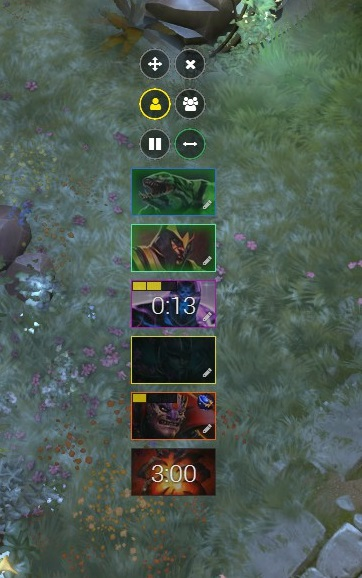

# Overwolf Dota 2 Cooldown - App

Dota 2 Cooldown is an [Overwolf](http://overwolf.com/) Overlay App that lets you set timers for your enemies' ultimates and aegis.

Use this tool in solo queue or with your party in Teamspeak to keep the timers in sync with your team.

With this app you and your team will always be one step ahead and know when to take fights. No more scrolling through the chat log for posted game times.

## Screenshots

## Features / Functionality

* Move window/Close window
* Pause all timers (when game is paused, hotkey enabled)
* Choose enemy side
* Select enemy heroes via searchable hero grid
* Select level of ultimate (defaults at 1)
* Check if enemy has scepter
* Start timer via click or hotkey
    * Timer will start with the corresponding time depending on level and scepter
* Heroes with passive ultimate or 0 cooldown ultimate are faded
* Level selector and Scepter will only be visible if it affects the hero's cooldown
* Start roshan timer when aegis is picked up
    * Counts down 6 minutes for aegis
    * Counts down 2 minutes for roshan downtime
    * Counts down 3 minutes with yellow border for uncertain time of roshan respawn
* Choose to share with team
    * Select teamspeak channel to join a shared lobby with other app users in the same teamspeak channel
    * Every action done will be synced with your team in the same channel

## Download

Currently not available in the official app store (submitted, in review). To use it, download the latest version in the `dist` folder and install via the Overwolf settings/Developer options/Load unpacked extension.

[Download v1.0.0](dist/overwolf-dota2-cooldown-1.0.0.tar.gz?raw=true)

## Notes

This app does in no way interfere with the Dota 2 files, so it is 100% legit. It can be considered a "collaborative stopwatch" system.

I chose to make it Teamspeak based because it makes it very convenient to generate lobbies based on the Teamspeak host and channel, thus eliminating the need to create server lobbies and share them with your team via copy and paste.

Feel free to give constructive feedback about this system via the [issues](https://github.com/bontscho/overwolf-dota2-cooldown/issues)

## FAQ

Ask questions via [issues](https://github.com/bontscho/overwolf-dota2-cooldown/issues) and the noteworthy ones will be added here.

## Roadmap

* Design rework, better integration into Dota 2 HUD
* Potential rework of the lobby system, depending on feedback and ease of use

--------------------
All game images and names are property of Valve Corporation.
